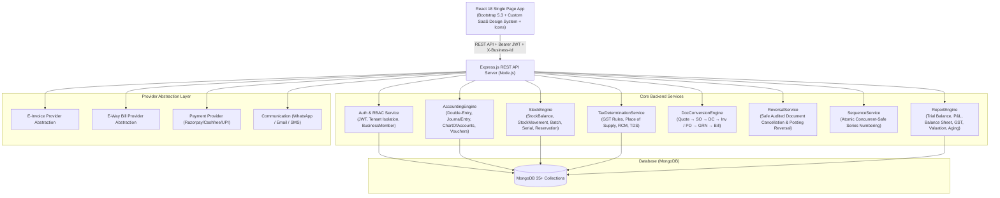
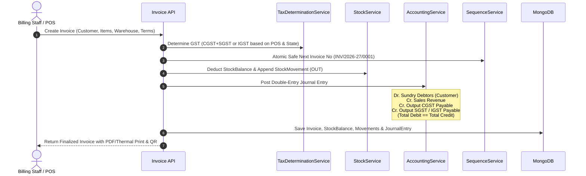
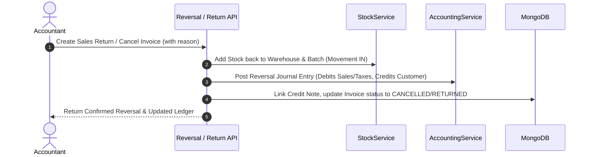

# Complete Billing & Inventory ERP – Master Implementation Plan (Enhanced Enterprise Edition)

A production-grade, multi-business, multi-branch, multi-warehouse **GST Billing, Inventory, Double-Entry Accounting & Business Management Web Application (ERP-lite)** built with 100% original architecture, UI/UX, and database design.

---

## 1. System Architecture Overview

---

## 2. Technology Stack & Key Libraries

- **Frontend**:
  - React 18 (JavaScript — strictly no TypeScript)
  - React Router DOM v6
  - Axios (with centralized JWT & `X-Business-Id` interceptors)
  - Bootstrap 5.3 + Bootstrap Icons
  - Custom CSS Design System (SaaS theme tokens, dark/light navbar, glass cards, micro-animations)
  - Chart.js & `react-chartjs-2`
  - `jspdf`, `jspdf-autotable`, `html2canvas`, and `@media print` CSS engine
  - `react-to-print` for thermal and A4 invoice printing
  - `canvas-confetti` for celebratory UX (invoice creation, payment settlement)
- **Backend**:
  - Node.js & Express.js (Modular REST API)
  - Mongoose & MongoDB (`mongodb://127.0.0.1:27017/billing_erp`)
  - `jsonwebtoken` & `bcryptjs`
  - `helmet`, `cors`, `morgan`, `express-rate-limit`
  - `express-validator`
  - `xlsx` & `json2csv` (Excel/CSV bulk import/export)
  - `multer` (Attachments & document uploads)
- **Zero-Dependency Core**: All financial double-entry math, GST tax rules, batch/serial allocations, and stock movement calculations run server-side without reliance on mock or fake third-party APIs.

---

## 3. Detailed Data Model Architecture (38+ Mongoose Schemas)

### A. Tenancy, Users & Access Control
1. `User`: `name`, `email`, `mobile`, `passwordHash`, `isSuperAdmin`, `status`, `createdAt`.
2. `Business`: `name`, `legalName`, `gstin`, `pan`, `cin`, `address`, `city`, `state`, `stateCode`, `pincode`, `email`, `phone`, `website`, `logoUrl`, `signatureUrl`, `bankDetails` (bankName, accountNo, ifsc, branch, upiId), `taxType` (regular, composition, unregistered), `financialYear` (e.g. `2026-27`), `settings` (dcStockPolicy: `NONE`|`RESERVE`|`DEDUCT`, allowNegativeStock, defaultTaxRate, invoiceTemplate).
3. `BusinessMember`: `businessId`, `userId`, `role` (`owner`, `admin`, `accountant`, `billing_user`, `inventory_manager`, `sales_user`, `purchase_user`, `custom`), `permissions` (view, create, edit, delete, export, print, approve, cancel for each module), `branchAccess` array, `warehouseAccess` array.
4. `Branch`: `businessId`, `name`, `code`, `address`, `state`, `stateCode`, `gstin`, `isDefault`.
5. `Warehouse`: `businessId`, `branchId`, `name`, `code`, `address`, `managerName`, `contactNumber`, `isDefault`.

### B. Double-Entry Accounting Core
6. `AccountGroup`: `businessId`, `name` (e.g., Current Assets, Sundry Debtors, Direct Expenses), `nature` (`Asset`, `Liability`, `Income`, `Expense`, `Equity`), `parentGroupId`, `isSystem`.
7. `ChartOfAccount`: `businessId`, `accountCode`, `name`, `groupId`, `type` (`cash`, `bank`, `customer`, `supplier`, `sales`, `purchase`, `gst_cgst`, `gst_sgst`, `gst_igst`, `expense`, `tds_payable`, `capital`), `openingBalance`, `currentBalance`, `isActive`.
8. `JournalEntry`: `businessId`, `branchId`, `entryNo`, `date`, `voucherType` (`sales`, `purchase`, `receipt`, `payment`, `contra`, `journal`, `expense`, `credit_note`, `debit_note`, `adjustment`), `voucherNo`, `referenceId`, `narration`, `totalDebit`, `totalCredit`, `isReversed`, `reversedByEntryId`.
9. `JournalEntryLine`: `journalEntryId`, `accountId`, `partyType` (`customer`, `supplier`, `employee`, `none`), `partyId`, `debit`, `credit`, `narration`.
10. `Voucher`: `businessId`, `voucherNo`, `voucherType`, `date`, `journalEntryId`, `partyId`, `amount`, `paymentMode`, `chequeNo`, `bankTransactionRef`.

### C. Cash & Bank Management
11. `BankAccount`: `businessId`, `bankName`, `accountNumber`, `ifscCode`, `branchName`, `openingBalance`, `currentBalance`, `upiId`, `chartOfAccountId`.
12. `BankTransaction`: `bankAccountId`, `date`, `type` (`deposit`, `withdrawal`, `charge`, `interest`), `amount`, `referenceNo`, `isReconciled`, `reconciledDate`.
13. `BankReconciliation`: `bankAccountId`, `statementStartDate`, `statementEndDate`, `statementClosingBalance`, `booksClosingBalance`, `matchedCount`, `unmatchedCount`, `status`.
14. `CashAccount`: `businessId`, `branchId`, `name`, `openingBalance`, `currentBalance`, `chartOfAccountId`.
15. `CashTransaction`: `cashAccountId`, `date`, `type` (`in`, `out`, `transfer`), `amount`, `referenceNo`, `narration`.

### D. Master Entities
16. `Customer`: `businessId`, `name`, `businessName`, `gstin`, `pan`, `phone`, `email`, `billingAddress`, `shippingAddress`, `state`, `stateCode`, `customerType` (`B2B`, `B2C`, `SEZ`), `creditLimit`, `creditDays`, `creditBlock`, `openingBalance`, `currentBalance`, `chartOfAccountId`, `priceListId`.
17. `Supplier`: `businessId`, `name`, `companyName`, `gstin`, `pan`, `phone`, `email`, `address`, `state`, `stateCode`, `openingBalance`, `currentBalance`, `chartOfAccountId`, `creditDays`.
18. `Product`: `businessId`, `name`, `sku`, `barcode`, `hsnSacCode`, `categoryId`, `brandId`, `unitId`, `alternateUnitId`, `unitConversionFactor`, `itemType` (`goods`, `service`), `purchasePrice`, `sellingPrice`, `wholesalePrice`, `mrp`, `taxRate`, `isTaxInclusive`, `minStockAlert`, `maxStock`, `hasBatch`, `hasSerial`, `isActive`.
19. `ProductBatch`: `businessId`, `productId`, `warehouseId`, `batchNumber`, `manufacturingDate`, `expiryDate`, `purchaseRate`, `sellingRate`, `quantity`, `reservedQuantity`, `availableQuantity`.
20. `ProductSerialNumber`: `businessId`, `productId`, `warehouseId`, `serialNumber`, `purchaseBillId`, `salesInvoiceId`, `customerId`, `warrantyStartDate`, `warrantyEndDate`, `status` (`in_stock`, `reserved`, `sold`, `returned`, `damaged`).
21. `Category`, `Brand`, `Unit`, `HSNMaster`, `TDSSection`.
22. `PriceList` & `PriceListItem`: `businessId`, `name`, `type` (`retail`, `wholesale`, `dealer`, `distributor`, `customer_tier`), `currency`, `items` (productId, minQty, rate, discountPercentage).
23. `Salesperson`: `businessId`, `name`, `phone`, `email`, `commissionPercentage`, `targetAmount`, `active`.

### E. Inventory Engine Core
24. `StockBalance`: `businessId`, `branchId`, `warehouseId`, `productId`, `batchId` (optional), `quantity`, `reservedQuantity`, `availableQuantity`, `averageCost`.
25. `StockMovement`: `businessId`, `warehouseId`, `productId`, `batchId`, `voucherType` (`invoice`, `sales_return`, `purchase_bill`, `purchase_return`, `delivery_challan`, `grn`, `adjustment`, `transfer`), `voucherNo`, `movementType` (`IN`, `OUT`), `quantity`, `rate`, `totalValue`, `balanceStockAfter`, `date`.
26. `StockReservation`: `businessId`, `salesOrderId`, `warehouseId`, `productId`, `batchId`, `quantity`, `status` (`active`, `fulfilled`, `cancelled`).
27. `StockAdjustment`: `businessId`, `warehouseId`, `adjustmentNo`, `date`, `type` (`increase`, `decrease`, `damaged`, `expired`), `reason`, `items` (productId, batchId, qty, rate), `status`.
28. `StockTransfer`: `businessId`, `transferNo`, `date`, `fromWarehouseId`, `toWarehouseId`, `items` (productId, batchId, qty), `status` (`in_transit`, `completed`, `cancelled`).

### F. Sales Transaction Suite
29. `Quotation`: `businessId`, `branchId`, `quotationNo`, `date`, `validUntil`, `customerId`, `salespersonId`, `items`, `subtotal`, `discount`, `taxBreakup`, `grandTotal`, `status` (`draft`, `sent`, `accepted`, `rejected`, `converted`, `cancelled`), `terms`.
30. `SalesOrder`: `businessId`, `branchId`, `orderNo`, `date`, `deliveryDate`, `customerId`, `items`, `orderedQty`, `deliveredQty`, `invoicedQty`, `financialTotals`, `status` (`draft`, `confirmed`, `partially_fulfilled`, `completed`, `cancelled`), `sourceDocumentId`.
31. `DeliveryChallan`: `businessId`, `branchId`, `warehouseId`, `challanNo`, `date`, `customerId`, `items`, `transportDetails` (transporterName, vehicleNo, lrNumber), `stockPolicyApplied` (`NONE`, `RESERVE`, `DEDUCT`), `status`.
32. `Invoice` (GST Tax Invoice): `businessId`, `branchId`, `warehouseId`, `invoiceNo`, `invoiceDate`, `dueDate`, `customerId`, `placeOfSupply`, `isInterState`, `items` (productId, hsn, qty, unit, rate, discount, taxableValue, cgst, sgst, igst, total), `subtotal`, `totalTax`, `roundOff`, `grandTotal`, `paidAmount`, `balanceAmount`, `paymentStatus` (`unpaid`, `partially_paid`, `paid`), `status` (`draft`, `finalized`, `cancelled`), `sourceDocumentId`, `eInvoiceDetails`, `eWayBillDetails`.
33. `SalesReturn`: `businessId`, `returnNo`, `date`, `invoiceId`, `customerId`, `warehouseId`, `items` (productId, batchId, qty, rate, tax), `reason`, `stockUpdated`, `creditNoteId`, `status`.
34. `CreditNote`: `businessId`, `creditNoteNo`, `date`, `invoiceId`, `salesReturnId`, `customerId`, `items`, `taxBreakup`, `grandTotal`, `reason` (`sales_return`, `rate_difference`, `discount_adjustment`, `damaged_goods`), `status`.
35. `RecurringInvoice`: `businessId`, `customerId`, `frequency` (`daily`, `weekly`, `monthly`, `yearly`), `startDate`, `endDate`, `nextRunDate`, `templateInvoiceId`, `status` (`active`, `paused`, `completed`).

### G. Purchase Transaction Suite
36. `PurchaseOrder`: `businessId`, `poNo`, `date`, `expectedDeliveryDate`, `supplierId`, `warehouseId`, `items` (productId, qty, receivedQty, rate, tax), `grandTotal`, `status` (`draft`, `approved`, `partially_received`, `completed`, `cancelled`).
37. `GoodsReceipt` (GRN): `businessId`, `grnNo`, `date`, `purchaseOrderId`, `supplierId`, `warehouseId`, `items` (productId, orderedQty, receivedQty, rejectedQty, batchNo, mfgDate, expiryDate), `status`.
38. `PurchaseBill`: `businessId`, `branchId`, `warehouseId`, `billNo`, `supplierInvoiceNo`, `billDate`, `supplierId`, `items`, `taxBreakup`, `grandTotal`, `paidAmount`, `balanceAmount`, `paymentStatus`, `status`, `grnId`.
39. `PurchaseReturn`: `businessId`, `returnNo`, `date`, `purchaseBillId`, `supplierId`, `warehouseId`, `items`, `reason`, `debitNoteId`, `status`.
40. `DebitNote`: `businessId`, `debitNoteNo`, `date`, `purchaseBillId`, `purchaseReturnId`, `supplierId`, `items`, `taxBreakup`, `grandTotal`, `reason`, `status`.

### H. Payments, Allocations, Expenses & TDS
41. `Payment`: `businessId`, `paymentNo`, `paymentType` (`in`, `out`), `partyType` (`customer`, `supplier`, `other`), `partyId`, `amount`, `paymentMode` (`cash`, `bank`, `upi`, `card`, `cheque`), `referenceNo`, `date`, `bankAccountId`, `cashAccountId`, `notes`.
42. `PaymentAllocation`: `paymentId`, `documentType` (`invoice`, `purchase_bill`, `debit_note`, `credit_note`), `documentId`, `allocatedAmount`, `date`.
43. `Expense`: `businessId`, `expenseNo`, `date`, `chartOfAccountId`, `category`, `vendorId`, `amount`, `taxRate`, `taxAmount`, `tdsSectionId`, `tdsRate`, `tdsAmount`, `netPayable`, `paymentMode`, `paidFromAccountId`, `status` (`pending_approval`, `approved`, `paid`).
44. `TDSTransaction`: `businessId`, `date`, `sectionId`, `deducteeType` (`company`, `non_company`), `deducteeId`, `pan`, `taxableAmount`, `tdsRate`, `tdsDeducted`, `voucherType`, `voucherNo`, `status` (`deducted`, `paid_to_govt`).

### I. Compliance, Reconciliation & Audit
45. `GSTReconciliation`: `businessId`, `period` (`month-year`), `reconciliationType` (`GSTR-2B_vs_Purchase`, `GSTR-1_vs_Sales`), `items` (gstin, invoiceNo, invoiceDate, taxableValue, taxAmount, status: `MATCHED`, `MISMATCH`, `MISSING_IN_BOOKS`, `MISSING_IN_PORTAL`, `DUPLICATE`).
46. `EInvoice` & `EWayBill`: `businessId`, `invoiceId`, `irn`, `ackNo`, `ackDate`, `ewbNo`, `ewbDate`, `validUntil`, `qrCodeData`, `signedPayload`, `status` (`generated`, `cancelled`), `auditLog`.
47. `ApprovalWorkflow` & `ApprovalRequest`: `businessId`, `module` (`purchase_order`, `sales_order`, `expense`, `credit_note`, `stock_adjustment`), `recordId`, `requestedBy`, `status` (`pending`, `approved`, `rejected`), `approvedBy`, `comments`.
48. `Attachment`: `businessId`, `entityType` (`invoice`, `purchase_bill`, `expense`, `customer`, `supplier`), `entityId`, `fileName`, `fileUrl`, `fileSize`, `mimeType`, `uploadedBy`.
49. `Sequence`: `businessId`, `branchId`, `financialYear`, `documentType` (`invoice`, `quote`, `so`, `po`, `bill`, `cn`, `dn`, `grn`, `sr`, `pr`, `dc`, `payment_in`, `payment_out`, `expense`, `journal`), `prefix`, `lastNumber`.
50. `AuditLog`: `businessId`, `userId`, `action`, `module`, `recordId`, `previousState`, `newState`, `ipAddress`, `timestamp`.
51. `Notification`: `businessId`, `userId`, `type` (`low_stock`, `credit_limit_exceeded`, `overdue_invoice`, `approval_request`), `title`, `message`, `isRead`, `linkUrl`.

---

## 4. Financial & Stock Engine Flowcharts

### A. Complete Double-Entry Sales Invoice Flow

### B. Sales Return & Cancellation Flow

---

## 5. Modules, API Endpoints & UI Pages Map

| Module | Key API Routes | Key UI Pages & Components |
|---|---|---|
| **Auth & Tenancy** | `POST /api/auth/register` `POST /api/auth/login` `GET /api/auth/me` `GET /api/businesses` `POST /api/businesses/switch` | `/login`, `/register`, `/forgot-password`, Business Switcher modal, Profile Settings |
| **Dashboard** | `GET /api/dashboard/kpis` `GET /api/dashboard/charts` `GET /api/dashboard/recent-activity` | Modern Executive Dashboard with KPI Cards, Sales vs Purchase charts, Low stock alerts, Receivables/Payables summary |
| **POS & Fast Billing** | `GET /api/pos/products/search` `POST /api/pos/checkout` | Split screen POS: Quick Barcode search, Hotkeys (F2/F4/F8/F9), Cart modifier, Split payment modal, Thermal print |
| **Sales Suite** | `/api/quotations` `/api/sales-orders` `/api/delivery-challans` `/api/invoices` `/api/sales-returns` `/api/credit-notes` | Quotation list/builder, Sales Order manager, Delivery Challan with stock policy, GST Invoice generator, Credit Note & Return screens |
| **Purchase Suite** | `/api/purchase-orders` `/api/grn` `/api/purchase-bills` `/api/purchase-returns` `/api/debit-notes` | PO creator, Goods Receipt (GRN) verification, Purchase Bill entries, Debit Notes & Purchase Returns |
| **Inventory & Stock** | `/api/products` `/api/inventory/balances` `/api/inventory/movements` `/api/inventory/batches` `/api/inventory/serials` `/api/inventory/adjustments` `/api/inventory/transfers` | Product Catalog, Stock Summary by Warehouse, Batch & Expiry Tracker, Serial Number Warranty tracker, Inter-warehouse transfers |
| **Contacts CRM** | `/api/customers` `/api/suppliers` `/api/customers/:id/statement` | Customer CRM (Ledgers, Outstanding, Credit Limit rules), Supplier CRM (Payables, Statement export) |
| **Double-Entry & Vouchers** | `/api/accounting/chart-of-accounts` `/api/accounting/journal-entries` `/api/accounting/vouchers` `/api/accounting/day-book` `/api/accounting/trial-balance` `/api/accounting/profit-loss` `/api/accounting/balance-sheet` | Chart of Accounts tree, Manual Journal Voucher builder, Day Book, General Ledger, Live Trial Balance, P&L, Balance Sheet |
| **Cash & Bank** | `/api/banking/accounts` `/api/banking/transactions` `/api/banking/reconcile` `/api/cash/accounts` | Bank Accounts ledger, Statement CSV upload & reconciliation tool, Cash Book & Contra cash transfers |
| **Payments & Expenses** | `/api/payments/in` `/api/payments/out` `/api/payments/allocate` `/api/expenses` | Payment In with multi-invoice allocation modal, Payment Out, Categorized Expense manager with TDS deduction |
| **Taxation & Compliance** | `/api/tax/gst-summary` `/api/tax/gstr-1` `/api/tax/gstr-3b` `/api/tax/gstr-reconciliation` `/api/tax/tds-summary` | GST Summary Dashboard, GSTR-1 & 3B calculation tables, GSTR-2B reconciliation tool, TDS deductible tracker |
| **Reports Suite** | `/api/reports/sales-register` `/api/reports/purchase-register` `/api/reports/stock-valuation` `/api/reports/receivables-aging` `/api/reports/payables-aging` | 18+ Interactive Reports with Date/Branch/Party filters, Excel/CSV Export, and Print/PDF preview |
| **Settings & Admin** | `/api/settings/business` `/api/settings/print-templates` `/api/settings/sequences` `/api/settings/members` `/api/settings/audit-logs` | Business Profile & Bank setup, 5-Template Invoice Customizer (Classic, Modern, Minimal, Pro, Thermal), User RBAC, Audit Log viewer |

---

## 6. Phased Implementation Roadmap (Phases 0 - 14)

### Phase 0: System Architecture, Core Engine Foundation & Setup
- Initialized Monorepo directory structure (`server/` and `client/`).
- Database connection configuration with MongoDB index optimizations.
- Core Service classes: `AccountingService`, `StockService`, `TaxDeterminationService`, `SequenceService`, `ReversalService`.
- Multi-tenancy middleware (`tenantContext` extracting `X-Business-Id` and enforcing strict tenant isolation).

### Phase 1: Authentication, Business Tenancy & RBAC
- User Registration, Secure Login with JWT, Multi-Business Creation & Switching.
- `BusinessMember` model with granular per-module permissions (`create`, `read`, `update`, `delete`, `export`, `print`, `approve`, `cancel`).
- Role pre-sets (`owner`, `admin`, `accountant`, `billing_user`, `inventory_manager`, `sales_user`, `purchase_user`).

### Phase 2: Financial Year, Chart of Accounts & Opening Balances
- System pre-loaded default Indian Chart of Accounts (Assets, Liabilities, Income, Expenses, Capital, GST accounts).
- Double-entry Journal Entry posting engine with total debit == total credit invariant.
- Opening balance input engine for Customers, Suppliers, Cash, Bank, and Inventory with auto-generated initial journal vouchers.

### Phase 3: Master Data & Masters UI
- Customers & Suppliers CRM with state codes, PAN, GSTIN format validators, and credit limit controls.
- Products Master: Goods vs Services (SAC), HSN codes, multi-tax rates (0%, 5%, 12%, 18%, 28%), unit conversion (Box -> Pieces, Kg -> Grams), price lists (Retail, Wholesale, Dealer).

### Phase 4: Inventory Engine, Multi-Warehouse, Batches & Serials
- `StockBalance` collection by warehouse & batch; `StockMovement` immutable audit trail.
- Product Batch manager with manufacturing/expiry date tracking & near-expiry warnings.
- Serial number registry with warranty tracking.
- Stock Adjustments (Damage, Expiry, Physical reconciliation) & Inter-Warehouse Stock Transfers.

### Phase 5: Sales Suite (Quotations, Orders, Challans, Invoices)
- Quotation builder with status lifecycle (`draft` -> `sent` -> `accepted` -> `converted`).
- Sales Order with stock reservation (`StockReservation`).
- Delivery Challans with configurable stock deduction policy (`NONE`, `RESERVE`, `DEDUCT`).
- GST Tax Invoices: Intra-state (CGST+SGST) vs Inter-state (IGST), B2B vs B2C, auto-roundoff, UPI QR generator.

### Phase 6: Purchase Suite (POs, GRN, Purchase Bills)
- Purchase Orders with multi-stage approval.
- Goods Receipt Note (GRN) tracking ordered vs received vs rejected quantities.
- Purchase Bills with input GST tax breakdown & accounts payable posting.

### Phase 7: Returns & Notes (Sales Return, Credit Note, Purchase Return, Debit Note)
- Sales Return -> Stock IN -> Credit Note -> Customer balance reduction -> Reversal journal entry.
- Purchase Return -> Stock OUT -> Debit Note -> Supplier payable reduction -> Reversal journal entry.

### Phase 8: Financial Management (Payments, Allocations, Expenses, Vouchers)
- Payment In with multi-invoice allocation modal (settle multiple outstanding bills in one transaction).
- Payment Out for supplier settlement.
- Expense tracker with Chart of Accounts linkage, TDS deduction, and payment voucher generation.
- Manual Journal & Contra voucher UI for accountants.

### Phase 9: Taxation, Compliance & GST Reconciliation
- GSTR-1, GSTR-3B summary generators based on real transaction ledger data.
- GST Reconciliation tool (compare uploaded JSON/CSV with internal purchase register).
- TDS section manager, deduction thresholds, and TDS payable summaries.

### Phase 10: E-Way Bill & E-Invoice Provider Abstraction
- Modular provider interface (`EInvoiceProvider`, `EWayBillProvider`) with payload builders, signed QR code renderer, and mock development driver.

### Phase 11: POS Fast Billing, Barcodes & 5 Invoice Print Templates
- Keyboard-friendly POS billing screen with instant barcode lookup and quick cash/UPI checkout.
- 5 Print & PDF Templates: **Classic**, **Modern**, **Minimal**, **Professional**, and **Thermal Slip (80mm/58mm)**.

### Phase 12: Executive Dashboard & Comprehensive Reports
- Dashboard KPIs (Today's Sales, Purchases, Cash Flow, Receivables, Payables, Stock Valuation).
- Double-Entry Reports: Live Trial Balance, Profit & Loss Statement, Balance Sheet, Day Book, Cash Book, Bank Book.
- Business Reports: Sales Register, Purchase Register, Stock Valuation, Customer/Supplier Aging Analysis.

### Phase 13: Advanced Workflows, Attachments & Bulk Data Tools
- Approval workflows for large POs, Credit Notes, and Expenses.
- File attachment manager for invoices, bills, and expense receipts.
- CSV/Excel Bulk Importer & Exporter for Customers, Suppliers, and Products.

### Phase 14: Demo Seed Data, Automated Tests & Polish
- Realistic Indian enterprise seed script (`seed.js`) generating complete business lifecycle:
  - Fictional business "Shree Ganesh Enterprises Pvt Ltd" (Maharashtra, 27AABCU9603R1ZM).
  - 3 Users (`owner@demo.local`, `accountant@demo.local`, `billing@demo.local` with password `Demo@12345`).
  - 2 Warehouses, 25 Customers, 15 Suppliers, 50 Products, Invoices, Purchase Bills, Returns, Payments, and Balanced Ledgers.
- Automated API test suite validating Double-Entry balance, GST calculations, Stock movements, and Tenant Isolation.

---

## 7. Verification & Definition of Done

### Automated Verification
- Run comprehensive integration test script testing:
  - Total Debit == Total Credit across all generated journal entries.
  - Intra-state vs Inter-state GST calculation accuracy.
  - Stock consistency between `StockBalance` and historical `StockMovement` sums.
  - Multi-invoice payment allocation balance math.
  - Tenant isolation preventing cross-business data access.

### Manual UI & Responsive Verification
- Verify POS fast checkout flow and instant thermal/A4 invoice preview.
- Test responsive navigation on mobile offcanvas drawer and desktop sidebar.
- Test PDF generation and print styling across all 5 invoice templates.
- Test Excel/CSV export on reports.
