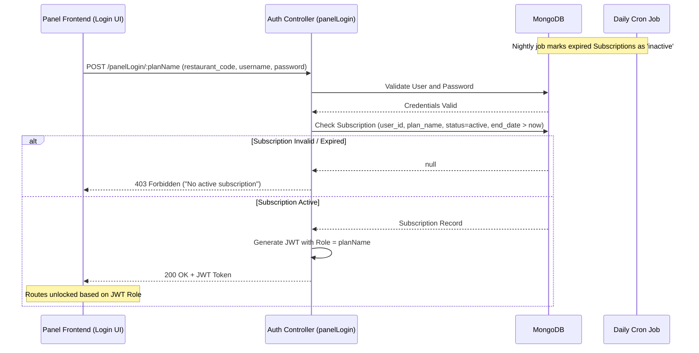

# Subscription Access Control Architecture

The Subscription Access Control in "The Box" ecosystem is a multi-tenant authentication and authorization system. It ensures that sub-users (Managers, QSR staff, Captains, etc.) can only access their respective panels if the parent restaurant owner (Tenant) has an active, valid subscription for that specific module.

---

## 1. Database Schema Design (MongoDB)

The subscription architecture revolves around three primary models to track plans and active purchases:

### `SubscriptionPlan`
Acts as the catalog of all available modules and packages.
- **`plan_name`**: e.g., "Manager", "QSR", "KOT Panel".
- **`plan_price`** & **`plan_duration`**: Cost and validity in months.
- **`is_addon`** & **`compatible_with`**: Determines if the module is standalone or requires a base plan.

### `Subscription`
Represents the actual purchase mapping between a Tenant (Restaurant Owner) and a Plan.
- **`user_id`**: Reference to the Tenant (`User` model).
- **`plan_id` / `plan_name`**: The purchased module.
- **`start_date`** & **`end_date`**: The validity period of the subscription.
- **`status`**: State of the subscription (`active`, `inactive`, `blocked`).

### `User` (Tenant)
The parent entity representing the restaurant.
- **`purchasedPlan`**: A string indicating the overall package tier (e.g., "Core", "Growth", "Scale").

---

## 2. Subscription Lifecycle

Subscriptions are managed centrally via the `subscriptionController.js`.

1. **Purchasing (`buyCompletePlan`)**: 
   When a restaurant owner selects a tier (e.g., "Scale"), the system maps this to an array of specific `SubscriptionPlan` names (e.g., Manager, QSR, Captain Panel, KOT Panel). Individual `Subscription` records are generated for each module with an `active` status and a calculated `end_date`.
2. **Expiration Tracking (Cron Job)**: 
   A daily cron job (`node-cron` running at `0 0 * * *`) scans the `Subscription` collection. Any subscription where `end_date` is less than today is automatically marked as `inactive`.
3. **Manual Overrides**: 
   Super-admins can manually `blockSubscriptions`, `unblockSubscription`, `renewSubscription`, or `expandSubscriptions` (extend end dates) via the API.

---

## 3. Access Control Mechanism (The Gatekeeper)

The actual gating of access happens at the **Authentication Phase** for Panel Users, primarily handled in `panelUserController.js`.

### The `panelLogin` Flow:
When a staff member attempts to log into a specific frontend application (e.g., Manager Portal, QSR Portal):

1. **Identify Tenant**: The system looks up the parent `User` using the provided `restaurant_code`.
2. **Verify Credentials**: It verifies the staff member's `username` and `password` against the specific panel collection (e.g., the `Manager` collection or `QSR` collection).
3. **Subscription Check (Crucial Step)**:
   Before granting access, the controller queries the `Subscription` collection:
   ```javascript
   const activeSubscription = await Subscription.findOne({
     user_id: user._id,
     plan_name: planName, // e.g., "Manager" or "QSR"
     status: "active",
     end_date: { $gt: new Date() }
   });
   ```
4. **Enforcement**: 
   - If the query returns `null`, the login is immediately rejected with a `403 Forbidden` status: *"No active subscription for [Plan]. Please purchase or renew the plan."*
   - If valid, the system generates a JWT.

---

## 4. Frontend Role Enforcement

Once the backend issues the JWT upon successful subscription validation, the frontend takes over to enforce granular access.

1. **JWT Payload**: The token payload contains the verified `Role` (which directly corresponds to the `planName`).
2. **Auth Context**: The frontend `auth-middlewares` and context providers decode this token.
3. **Route Guards (`helper.js`)**: The frontend uses a recursive routing helper (`userHasRole`) to ensure that users cannot navigate to unauthorized components via URL manipulation. If the token role doesn't match the route's required roles, the route is hidden or blocked.

---

## Architecture Flow Diagram


