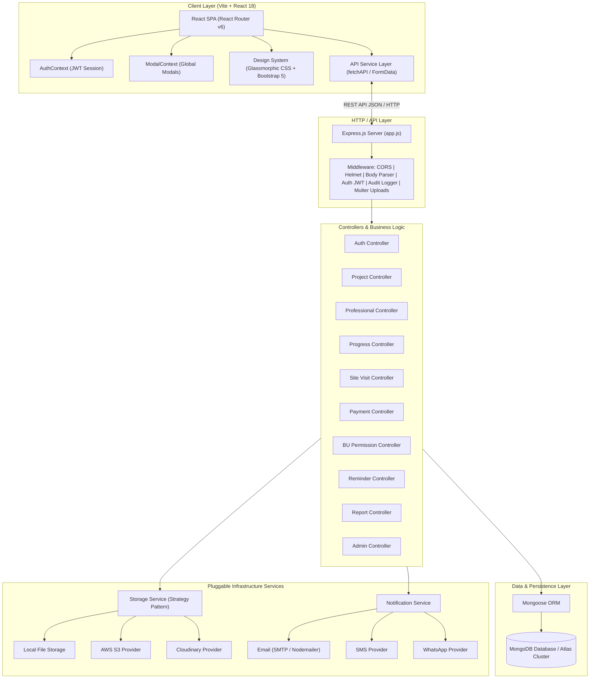
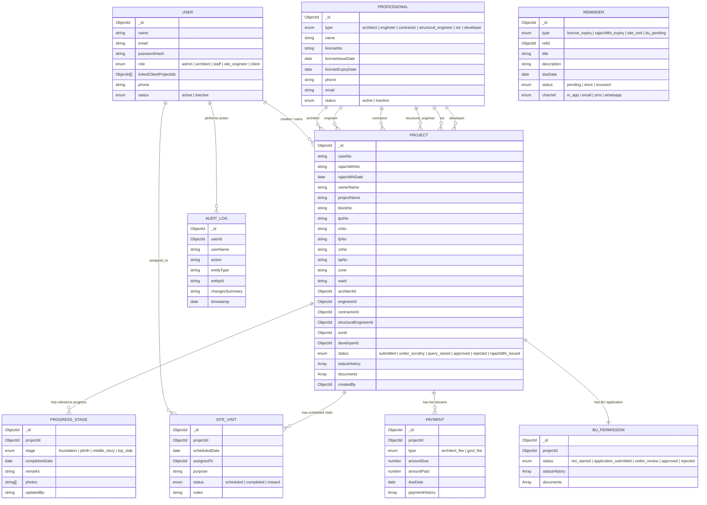
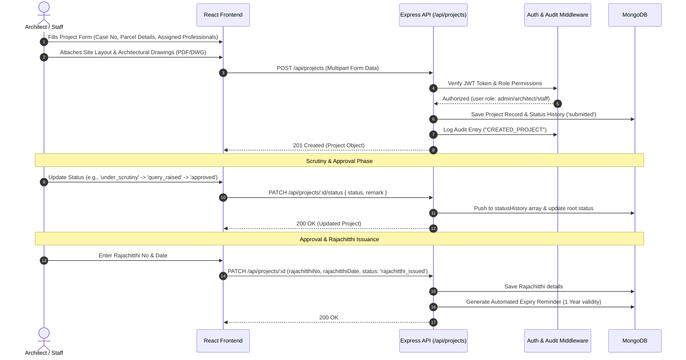
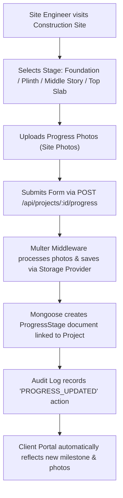
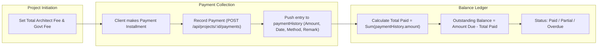
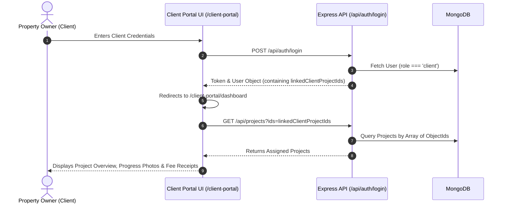

# Architect PMS — System Architecture & Workflow Blueprint

## 1. Executive Summary & System Overview

**Architect PMS** (Project Management System) is an enterprise-grade web application designed specifically for architecture firms, civil engineering consultancies, and municipal project administrators. The platform manages the full lifecycle of architectural and construction projects, tracking municipal case filings, Rajachitthi (building permission) approvals, professional registrations, site progress stages, site visits, client payments, building use (BU) permissions, and system notifications.

### Primary Domain Objectives
- **Municipal Permitting & Tracking**: Track case numbers, Rajachitthi approvals, zone/ward classifications, and municipal parcel details (Block No, TPS No, RS No, FP No, CS No, SP No).
- **Professional Registration & Expiry Management**: Track licensed architects, structural engineers, site engineers, contractors, SORs, and developers, enforcing automated reminders prior to license expiration.
- **Construction Progress Verification**: Milestone tracking across four standardized stages: Foundation, Plinth, Middle Story, and Top Slab with photographic evidence.
- **Financial & Fee Management**: Dual-stream accounting for Architect Fees and Government Fees with installment payment history and balance tracking.
- **Site Visit Operations**: Schedule, assign, and track field visits conducted by site engineers or architects.
- **Building Use (BU) Permission Lifecycle**: Dedicated workflow tracking for final occupancy certification.
- **Client Transparency Portal**: Read-only portal enabling property owners to view progress photos, download approval documents, and track payment receipts.

---

## 2. High-Level System Architecture

Architect PMS is built on a decoupled **MERN Architecture** (MongoDB, Express, React, Node.js) with pluggable service providers for file storage and multi-channel notifications.



---

## 3. Directory Structure & Blueprint Mapping

Below is the complete directory structure mapping for the `/architect-pms` codebase:

```
architect-pms/
├── client/                                    # Frontend React Application (Vite)
│   ├── index.html                             # Single Page Application HTML Entry point
│   ├── package.json                           # [Client Package Manifest](file:///d:/Digital%20Tripoly%20Studio/TheBoxSync/architect-pms/client/package.json)
│   ├── vite.config.js                         # [Vite Build & Proxy Config](file:///d:/Digital%20Tripoly%20Studio/TheBoxSync/architect-pms/client/vite.config.js)
│   └── src/
│       ├── main.jsx                           # [React Mount Script](file:///d:/Digital%20Tripoly%20Studio/TheBoxSync/architect-pms/client/src/main.jsx)
│       ├── App.jsx                            # [Root Component & Router Setup](file:///d:/Digital%20Tripoly%20Studio/TheBoxSync/architect-pms/client/src/App.jsx)
│       ├── components/
│       │   ├── CalendarView.jsx               # [Interactive Calendar for Site Visits](file:///d:/Digital%20Tripoly%20Studio/TheBoxSync/architect-pms/client/src/components/CalendarView.jsx)
│       │   ├── index.js                       # Barrel export file
│       │   ├── common/
│       │   │   ├── GlassCard.jsx              # [Glassmorphic Card Wrapper](file:///d:/Digital%20Tripoly%20Studio/TheBoxSync/architect-pms/client/src/components/common/GlassCard.jsx)
│       │   │   ├── LoadingGlass.jsx           # [Glassmorphic Loader Spinner](file:///d:/Digital%20Tripoly%20Studio/TheBoxSync/architect-pms/client/src/components/common/LoadingGlass.jsx)
│       │   │   ├── PageHeader.jsx             # [Standard Page Header Component](file:///d:/Digital%20Tripoly%20Studio/TheBoxSync/architect-pms/client/src/components/common/PageHeader.jsx)
│       │   │   ├── PrismButton.jsx            # [Gradient Modern Action Button](file:///d:/Digital%20Tripoly%20Studio/TheBoxSync/architect-pms/client/src/components/common/PrismButton.jsx)
│       │   │   └── StatusBadge.jsx            # [Color-Coded Status Badge Component](file:///d:/Digital%20Tripoly%20Studio/TheBoxSync/architect-pms/client/src/components/common/StatusBadge.jsx)
│       │   └── layout/
│       │       ├── Sidebar.jsx                # [Collapsible Main Navigation Sidebar](file:///d:/Digital%20Tripoly%20Studio/TheBoxSync/architect-pms/client/src/components/layout/Sidebar.jsx)
│       │       └── Topbar.jsx                 # [Top App Bar with User Profile & Notifications](file:///d:/Digital%20Tripoly%20Studio/TheBoxSync/architect-pms/client/src/components/layout/Topbar.jsx)
│       ├── context/
│       │   ├── AuthContext.jsx                # [JWT Authentication & User Session Context](file:///d:/Digital%20Tripoly%20Studio/TheBoxSync/architect-pms/client/src/context/AuthContext.jsx)
│       │   └── ModalContext.jsx               # [Global Modal State & Dialog Management](file:///d:/Digital%20Tripoly%20Studio/TheBoxSync/architect-pms/client/src/context/ModalContext.jsx)
│       ├── features/
│       │   ├── masterData/services/
│       │   │   └── professionalService.js     # [Professional API Service Methods](file:///d:/Digital%20Tripoly%20Studio/TheBoxSync/architect-pms/client/src/features/masterData/services/professionalService.js)
│       │   └── projects/services/
│       │       └── projectService.js          # [Project API Service Methods](file:///d:/Digital%20Tripoly%20Studio/TheBoxSync/architect-pms/client/src/features/projects/services/projectService.js)
│       ├── pages/
│       │   ├── AdminAuditLogPage.jsx          # [System Audit Trail Viewer](file:///d:/Digital%20Tripoly%20Studio/TheBoxSync/architect-pms/client/src/pages/AdminAuditLogPage.jsx)
│       │   ├── AdminUsersPage.jsx             # [User Management & Role Assignment](file:///d:/Digital%20Tripoly%20Studio/TheBoxSync/architect-pms/client/src/pages/AdminUsersPage.jsx)
│       │   ├── ClientDashboardPage.jsx        # [Client Portal View](file:///d:/Digital%20Tripoly%20Studio/TheBoxSync/architect-pms/client/src/pages/ClientDashboardPage.jsx)
│       │   ├── CreateBannerPage.jsx           # [Project Canvas & Banner Builder Tool](file:///d:/Digital%20Tripoly%20Studio/TheBoxSync/architect-pms/client/src/pages/CreateBannerPage.jsx)
│       │   ├── CreateProjectPage.jsx          # [New Project Form & Document Upload](file:///d:/Digital%20Tripoly%20Studio/TheBoxSync/architect-pms/client/src/pages/CreateProjectPage.jsx)
│       │   ├── DashboardPage.jsx              # [Main Analytics Dashboard](file:///d:/Digital%20Tripoly%20Studio/TheBoxSync/architect-pms/client/src/pages/DashboardPage.jsx)
│       │   ├── DataEntryPage.jsx              # [Master Data Entry & Professional Registry](file:///d:/Digital%20Tripoly%20Studio/TheBoxSync/architect-pms/client/src/pages/DataEntryPage.jsx)
│       │   ├── LoginPage.jsx                  # [Staff & Client Portal Login Screen](file:///d:/Digital%20Tripoly%20Studio/TheBoxSync/architect-pms/client/src/pages/LoginPage.jsx)
│       │   ├── ProjectDetailPage.jsx          # [360° Project Hub (Tabs: Info, Stages, Payments, BU, Docs)](file:///d:/Digital%20Tripoly%20Studio/TheBoxSync/architect-pms/client/src/pages/ProjectDetailPage.jsx)
│       │   ├── ProjectListPage.jsx            # [Filterable Project Table & Search](file:///d:/Digital%20Tripoly%20Studio/TheBoxSync/architect-pms/client/src/pages/ProjectListPage.jsx)
│       │   ├── RemindersPage.jsx              # [Alerts & Expiry Reminder Manager](file:///d:/Digital%20Tripoly%20Studio/TheBoxSync/architect-pms/client/src/pages/RemindersPage.jsx)
│       │   ├── ReportsPage.jsx                # [PDF/Excel Export & Analytics Reports](file:///d:/Digital%20Tripoly%20Studio/TheBoxSync/architect-pms/client/src/pages/ReportsPage.jsx)
│       │   └── SiteVisitsPage.jsx             # [Site Visit Scheduler & Calendar](file:///d:/Digital%20Tripoly%20Studio/TheBoxSync/architect-pms/client/src/pages/SiteVisitsPage.jsx)
│       ├── services/
│       │   └── api.js                         # [Central HTTP Client (`fetchAPI`)](file:///d:/Digital%20Tripoly%20Studio/TheBoxSync/architect-pms/client/src/services/api.js)
│       └── styles/
│           ├── index.css                      # [Main Design System & Layout Utilities](file:///d:/Digital%20Tripoly%20Studio/TheBoxSync/architect-pms/client/src/styles/index.css)
│           └── variables.css                  # [CSS Tokens (Colors, Glass Filters, Shadows)](file:///d:/Digital%20Tripoly%20Studio/TheBoxSync/architect-pms/client/src/styles/variables.css)
│
└── server/                                    # Backend Express API Server
    ├── migrate.js                             # [DB Migration Script (Local MongoDB → Atlas)](file:///d:/Digital%20Tripoly%20Studio/TheBoxSync/architect-pms/server/migrate.js)
    ├── package.json                           # [Server Package Manifest](file:///d:/Digital%20Tripoly%20Studio/TheBoxSync/architect-pms/server/package.json)
    └── src/
        ├── app.js                             # [Express App Middleware & Route Registry](file:///d:/Digital%20Tripoly%20Studio/TheBoxSync/architect-pms/server/src/app.js)
        ├── seed.js                            # [Database Seeder for Test Data & Admin Account](file:///d:/Digital%20Tripoly%20Studio/TheBoxSync/architect-pms/server/src/seed.js)
        ├── server.js                          # [HTTP Server Listener & Process Initialization](file:///d:/Digital%20Tripoly%20Studio/TheBoxSync/architect-pms/server/src/server.js)
        ├── config/
        │   ├── db.js                          # [MongoDB Mongoose Connection Handler](file:///d:/Digital%20Tripoly%20Studio/TheBoxSync/architect-pms/server/src/config/db.js)
        │   └── env.js                         # [Environment Variables Config](file:///d:/Digital%20Tripoly%20Studio/TheBoxSync/architect-pms/server/src/config/env.js)
        ├── controllers/
        │   ├── adminController.js             # [Admin User Management & Audit Log APIs](file:///d:/Digital%20Tripoly%20Studio/TheBoxSync/architect-pms/server/src/controllers/adminController.js)
        │   ├── authController.js              # [Login, Logout, Current User Info APIs](file:///d:/Digital%20Tripoly%20Studio/TheBoxSync/architect-pms/server/src/controllers/authController.js)
        │   ├── buPermissionController.js      # [BU Permission Workflow APIs](file:///d:/Digital%20Tripoly%20Studio/TheBoxSync/architect-pms/server/src/controllers/buPermissionController.js)
        │   ├── paymentController.js           # [Fee Management & Payment Record APIs](file:///d:/Digital%20Tripoly%20Studio/TheBoxSync/architect-pms/server/src/controllers/paymentController.js)
        │   ├── professionalController.js      # [Professional Registry CRUD APIs](file:///d:/Digital%20Tripoly%20Studio/TheBoxSync/architect-pms/server/src/controllers/professionalController.js)
        │   ├── progressController.js          # [Construction Progress Stage APIs](file:///d:/Digital%20Tripoly%20Studio/TheBoxSync/architect-pms/server/src/controllers/progressController.js)
        │   ├── projectController.js           # [Core Project CRUD & Status History APIs](file:///d:/Digital%20Tripoly%20Studio/TheBoxSync/architect-pms/server/src/controllers/projectController.js)
        │   ├── reminderController.js          # [Reminder CRUD & Auto-Generation APIs](file:///d:/Digital%20Tripoly%20Studio/TheBoxSync/architect-pms/server/src/controllers/reminderController.js)
        │   ├── reportController.js            # [Export Analytics & Report Generator APIs](file:///d:/Digital%20Tripoly%20Studio/TheBoxSync/architect-pms/server/src/controllers/reportController.js)
        │   └── siteVisitController.js         # [Site Visit Scheduling APIs](file:///d:/Digital%20Tripoly%20Studio/TheBoxSync/architect-pms/server/src/controllers/siteVisitController.js)
        ├── middleware/
        │   ├── audit.js                       # [Audit Log Generator Middleware](file:///d:/Digital%20Tripoly%20Studio/TheBoxSync/architect-pms/server/src/middleware/audit.js)
        │   ├── auth.js                        # [JWT Authentication & Role Guard Middleware](file:///d:/Digital%20Tripoly%20Studio/TheBoxSync/architect-pms/server/src/middleware/auth.js)
        │   ├── errorHandler.js                # [Centralized Error Handler Middleware](file:///d:/Digital%20Tripoly%20Studio/TheBoxSync/architect-pms/server/src/middleware/errorHandler.js)
        │   └── upload.js                      # [Multer Storage Engine Middleware](file:///d:/Digital%20Tripoly%20Studio/TheBoxSync/architect-pms/server/src/middleware/upload.js)
        ├── models/
        │   ├── AuditLog.js                    # [Audit Log Mongoose Schema](file:///d:/Digital%20Tripoly%20Studio/TheBoxSync/architect-pms/server/src/models/AuditLog.js)
        │   ├── BUPermission.js                # [BU Permission Mongoose Schema](file:///d:/Digital%20Tripoly%20Studio/TheBoxSync/architect-pms/server/src/models/BUPermission.js)
        │   ├── Payment.js                     # [Payment & Fee Mongoose Schema](file:///d:/Digital%20Tripoly%20Studio/TheBoxSync/architect-pms/server/src/models/Payment.js)
        │   ├── Professional.js                # [Licensed Professional Mongoose Schema](file:///d:/Digital%20Tripoly%20Studio/TheBoxSync/architect-pms/server/src/models/Professional.js)
        │   ├── ProgressStage.js               # [Progress Stage Mongoose Schema](file:///d:/Digital%20Tripoly%20Studio/TheBoxSync/architect-pms/server/src/models/ProgressStage.js)
        │   ├── Project.js                     # [Main Project Mongoose Schema](file:///d:/Digital%20Tripoly%20Studio/TheBoxSync/architect-pms/server/src/models/Project.js)
        │   ├── Reminder.js                    # [Reminder Mongoose Schema](file:///d:/Digital%20Tripoly%20Studio/TheBoxSync/architect-pms/server/src/models/Reminder.js)
        │   ├── SiteVisit.js                   # [Site Visit Mongoose Schema](file:///d:/Digital%20Tripoly%20Studio/TheBoxSync/architect-pms/server/src/models/SiteVisit.js)
        │   └── User.js                        # [User & Auth Mongoose Schema](file:///d:/Digital%20Tripoly%20Studio/TheBoxSync/architect-pms/server/src/models/User.js)
        ├── routes/
        │   ├── adminRoutes.js                 # [/api/admin Route Definition](file:///d:/Digital%20Tripoly%20Studio/TheBoxSync/architect-pms/server/src/routes/adminRoutes.js)
        │   ├── authRoutes.js                  # [/api/auth Route Definition](file:///d:/Digital%20Tripoly%20Studio/TheBoxSync/architect-pms/server/src/routes/authRoutes.js)
        │   ├── buPermissionRoutes.js          # [/api/projects/:id/bu-permission Route Definition](file:///d:/Digital%20Tripoly%20Studio/TheBoxSync/architect-pms/server/src/routes/buPermissionRoutes.js)
        │   ├── paymentRoutes.js               # [/api/projects/:id/payments Route Definition](file:///d:/Digital%20Tripoly%20Studio/TheBoxSync/architect-pms/server/src/routes/paymentRoutes.js)
        │   ├── professionalRoutes.js          # [/api/professionals Route Definition](file:///d:/Digital%20Tripoly%20Studio/TheBoxSync/architect-pms/server/src/routes/professionalRoutes.js)
        │   ├── progressRoutes.js              # [/api/projects/:id/progress Route Definition](file:///d:/Digital%20Tripoly%20Studio/TheBoxSync/architect-pms/server/src/routes/progressRoutes.js)
        │   ├── projectRoutes.js               # [/api/projects Route Definition](file:///d:/Digital%20Tripoly%20Studio/TheBoxSync/architect-pms/server/src/routes/projectRoutes.js)
        │   ├── reminderRoutes.js              # [/api/reminders Route Definition](file:///d:/Digital%20Tripoly%20Studio/TheBoxSync/architect-pms/server/src/routes/reminderRoutes.js)
        │   ├── reportRoutes.js                # [/api/reports Route Definition](file:///d:/Digital%20Tripoly%20Studio/TheBoxSync/architect-pms/server/src/routes/reportRoutes.js)
        │   └── siteVisitRoutes.js             # [/api/site-visits Route Definition](file:///d:/Digital%20Tripoly%20Studio/TheBoxSync/architect-pms/server/src/routes/siteVisitRoutes.js)
        ├── services/
        │   ├── notificationService.js         # [Central Notification Dispatcher Service](file:///d:/Digital%20Tripoly%20Studio/TheBoxSync/architect-pms/server/src/services/notificationService.js)
        │   ├── professionalService.js         # [Professional Business Logic Service](file:///d:/Digital%20Tripoly%20Studio/TheBoxSync/architect-pms/server/src/services/professionalService.js)
        │   ├── projectService.js              # [Project Core Business Logic Service](file:///d:/Digital%20Tripoly%20Studio/TheBoxSync/architect-pms/server/src/services/projectService.js)
        │   ├── notification/
        │   │   ├── emailProvider.js           # [Email Provider (Nodemailer/SMTP)](file:///d:/Digital%20Tripoly%20Studio/TheBoxSync/architect-pms/server/src/services/notification/emailProvider.js)
        │   │   ├── notificationService.js     # [Multi-channel Notification Orchestrator](file:///d:/Digital%20Tripoly%20Studio/TheBoxSync/architect-pms/server/src/services/notification/notificationService.js)
        │   │   ├── smsProvider.js             # [SMS Service Provider Interface](file:///d:/Digital%20Tripoly%20Studio/TheBoxSync/architect-pms/server/src/services/notification/smsProvider.js)
        │   │   └── whatsappProvider.js        # [WhatsApp API Interface](file:///d:/Digital%20Tripoly%20Studio/TheBoxSync/architect-pms/server/src/services/notification/whatsappProvider.js)
        │   └── storage/
        │       ├── cloudinaryStorage.js       # [Cloudinary CDN Storage Implementation](file:///d:/Digital%20Tripoly%20Studio/TheBoxSync/architect-pms/server/src/services/storage/cloudinaryStorage.js)
        │       ├── localStorage.js            # [Local Disk Storage Implementation](file:///d:/Digital%20Tripoly%20Studio/TheBoxSync/architect-pms/server/src/services/storage/localStorage.js)
        │       ├── s3Storage.js               # [AWS S3 Bucket Storage Implementation](file:///d:/Digital%20Tripoly%20Studio/TheBoxSync/architect-pms/server/src/services/storage/s3Storage.js)
        │       └── storageService.js          # [Pluggable Storage Strategy Controller](file:///d:/Digital%20Tripoly%20Studio/TheBoxSync/architect-pms/server/src/services/storage/storageService.js)
        └── utils/
            ├── appError.js                    # [Custom Operational AppError Class](file:///d:/Digital%20Tripoly%20Studio/TheBoxSync/architect-pms/server/src/utils/appError.js)
            ├── catchAsync.js                  # [Async Handler Wrapper Function](file:///d:/Digital%20Tripoly%20Studio/TheBoxSync/architect-pms/server/src/utils/catchAsync.js)
            └── dateFormatter.js               # [Date Formatting Utilities](file:///d:/Digital%20Tripoly%20Studio/TheBoxSync/architect-pms/server/src/utils/dateFormatter.js)
```

---

## 4. Data Models & Entity Relationship Diagram (ERD)



### Data Schema Breakdown

| Entity Model | Primary Responsibilities | Key Fields & Constraints |
| :--- | :--- | :--- |
| **User** | User account management, authentication, role authorization, and client portal project linking. | `email` (unique), `role` (enum: admin, architect, staff, site_engineer, client), `linkedClientProjectIds` (array of Project refs). |
| **Professional** | External licensed consultants registry & compliance tracking. | `type` (enum: architect, engineer, contractor, etc.), `licenseNo`, `licenseIssueDate`, `licenseExpiryDate`. |
| **Project** | Core entity containing municipal parcel metadata, assigned professional references, permission status, status history, and uploaded drawings. | `caseNo` (unique), `status` (enum: submitted, under_scrutiny, query_raised, approved, rejected, rajachitthi_issued), `statusHistory` array. |
| **ProgressStage** | Site construction milestone tracking. | `projectId`, `stage` (foundation, plinth, middle_story, top_slab), `photos` (array of image URLs). |
| **SiteVisit** | Calendar & inspection scheduling. | `projectId`, `scheduledDate`, `assignedTo` (User ref), `status` (scheduled, completed, missed). |
| **Payment** | Dual-track fee ledger (Architect vs Government). | `projectId`, `type` (architect_fee, govt_fee), `amountDue`, `amountPaid`, `paymentHistory` (array of payments). |
| **BUPermission** | Final occupancy approval process tracking. | `projectId` (unique), `status` (not_started, application_submitted, under_review, approved, rejected), `documents`. |
| **Reminder** | System-wide automated alerts for deadlines & compliance. | `type` (license_expiry, rajachitthi_expiry, site_visit, bu_pending), `dueDate`, `channel`. |
| **AuditLog** | Immutable activity log for governance & security audits. | `userId`, `action`, `entityType`, `entityId`, `changesSummary`, `timestamp`. |

---

## 5. User Roles & Access Control Matrix

Architect PMS implements role-based access control (RBAC) via the `checkRole` middleware in [`auth.js`](file:///d:/Digital%20Tripoly%20Studio/TheBoxSync/architect-pms/server/src/middleware/auth.js).

| Feature / Action | Admin | Architect | Staff | Site Engineer | Client |
| :--- | :---: | :---: | :---: | :---: | :---: |
| **User Management** (Create/Edit users, change roles) | ✅ | ❌ | ❌ | ❌ | ❌ |
| **Audit Log Inspection** | ✅ | ❌ | ❌ | ❌ | ❌ |
| **Create / Edit Projects** | ✅ | ✅ | ✅ | ❌ | ❌ |
| **Update Municipal Status & Rajachitthi** | ✅ | ✅ | ✅ | ❌ | ❌ |
| **Register Professionals & Expiry Tracking** | ✅ | ✅ | ✅ | ❌ | ❌ |
| **Update Construction Progress Stages** | ✅ | ✅ | ✅ | ✅ | ❌ |
| **Schedule Site Visits** | ✅ | ✅ | ✅ | ❌ | ❌ |
| **Execute & Log Site Visits** | ✅ | ✅ | ✅ | ✅ | ❌ |
| **Manage Payments & Fee Receipts** | ✅ | ✅ | ✅ | ❌ | ❌ |
| **BU Permission Applications** | ✅ | ✅ | ✅ | ❌ | ❌ |
| **Export Analytics & PDF/Excel Reports** | ✅ | ✅ | ✅ | ❌ | ❌ |
| **Client Portal View (Linked Projects Only)** | ❌ | ❌ | ❌ | ❌ | ✅ |

---

## 6. Core Business Workflows

### 6.1 Municipal Project Lifecycle Workflow



### 6.2 Construction Progress Stage & Photo Evidence Workflow



### 6.3 Financial Management & Fee Tracking Workflow



### 6.4 Client Portal Access Workflow



---

## 7. Cross-Cutting Architectural Patterns

### 7.1 Centralized Error Handling & Async Execution
- All async controller methods are wrapped using [`catchAsync.js`](file:///d:/Digital%20Tripoly%20Studio/TheBoxSync/architect-pms/server/src/utils/catchAsync.js) to eliminate boilerplate `try/catch` blocks.
- Operational errors inherit from [`appError.js`](file:///d:/Digital%20Tripoly%20Studio/TheBoxSync/architect-pms/server/src/utils/appError.js) with explicit HTTP status codes.
- Global express error middleware ([`errorHandler.js`](file:///d:/Digital%20Tripoly%20Studio/TheBoxSync/architect-pms/server/src/middleware/errorHandler.js)) intercepts uncaught exceptions, formatting standardized JSON error responses.

### 7.2 Pluggable File Storage (Strategy Pattern)
The file storage engine ([`storageService.js`](file:///d:/Digital%20Tripoly%20Studio/TheBoxSync/architect-pms/server/src/services/storage/storageService.js)) uses the Strategy Pattern based on `STORAGE_PROVIDER` in environment configuration:
- `local`: Writes directly to the `/uploads` directory (Static Express serve).
- `s3`: Uploads to AWS S3 buckets using AWS SDK.
- `cloudinary`: Uploads to Cloudinary CDN with automatic media transformations.

### 7.3 Multi-Channel Notification Orchestrator
The notification service ([`notificationService.js`](file:///d:/Digital%20Tripoly%20Studio/TheBoxSync/architect-pms/server/src/services/notification/notificationService.js)) abstracts dispatching across Email (Nodemailer), SMS, and WhatsApp providers.

### 7.4 Immutable Audit Logging
Whenever sensitive business operations occur (e.g., project deletion, payment updates, user role changes), the [`logAudit`](file:///d:/Digital%20Tripoly%20Studio/TheBoxSync/architect-pms/server/src/middleware/audit.js) helper automatically appends an immutable document to the `AuditLog` collection.

---

## 8. Developer Guide for Future Changes

### 8.1 How to Add a New Domain Entity (e.g., "Inspection Report")

1. **Define Mongoose Model**:
   - Create `architect-pms/server/src/models/InspectionReport.js`.
   - Define fields, references to `Project` / `User`, and `timestamps: true`.

2. **Build Express Controller**:
   - Create `architect-pms/server/src/controllers/inspectionReportController.js`.
   - Use `catchAsync` for handlers (`getReports`, `createReport`, `deleteReport`).
   - Call `logAudit()` on mutations.

3. **Define Express Routes**:
   - Create `architect-pms/server/src/routes/inspectionReportRoutes.js`.
   - Apply `authenticateToken` and `checkRole(['admin', 'architect'])`.

4. **Register Route in App**:
   - Update `architect-pms/server/src/app.js`:
     ```javascript
     const inspectionReportRoutes = require('./routes/inspectionReportRoutes');
     app.use('/api/inspection-reports', inspectionReportRoutes);
     ```

5. **Create Client Service & UI Component**:
   - Add frontend service in `architect-pms/client/src/features/reports/services/inspectionService.js`.
   - Create React view component in `architect-pms/client/src/pages/InspectionReportPage.jsx`.
   - Add route definition to `AppRoutes` in [`App.jsx`](file:///d:/Digital%20Tripoly%20Studio/TheBoxSync/architect-pms/client/src/App.jsx).

### 8.2 Database Migration & Seeding Procedures
- **Local to Atlas Migration**: Run `node server/migrate.js` to transfer local MongoDB collections to a cloud Atlas cluster.
- **Seeding Test Environment**: Run `npm run seed` inside `/server` to generate seed users, projects, professionals, and payments.

---
*Architectural Specification Created for Architect PMS Repository (`/architect-pms`).*
