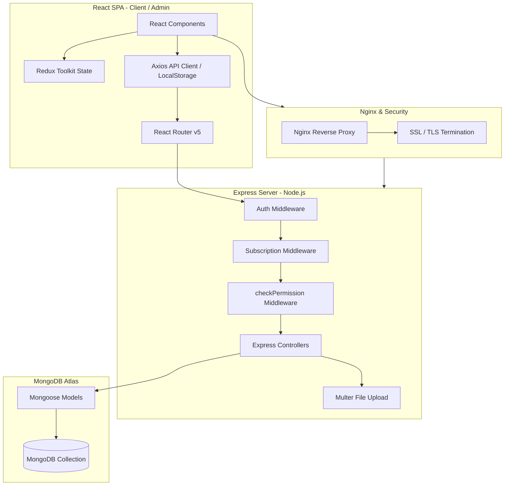

# Codebase Audit & Architectural Review
**Project Name:** Hotel Management Software (MERN Stack)  
**Auditor Role:** Senior Software Architect, Principal MERN Engineer, Security Auditor, DevOps Engineer, Database Architect, and Product Reviewer  
**Target Release Stage:** Pre-Production Release Audit  

---

## 1. Project Architecture & Technical Overview

This system is built as a multi-tenant Hotel Management SaaS platform using the MERN stack. The backend runs Node.js/Express.js with MongoDB (via Mongoose), and the frontend is split into two React applications (`/client` and `/admin`). Let's dissect the core architectural design and trace the structural flows.

### Architectural Blueprint



### Architectural Breakdown

1. **Overall Architecture (Rating: 5/10):**  
   The application claims to be a multi-tenant SaaS. However, tenant isolation is poorly implemented at the application layer using manual filters rather than a robust tenant routing wrapper, database-per-tenant isolation, or logical schema segregation. The separation of concerns is weak; business logic, database queries, permission checking, and validation are tightly coupled inside controller methods, rendering unit testing virtually impossible.
2. **Project Structure:**  
   The workspace is divided into `/server` (backend API), `/client` (hotel operations frontend), and `/admin` (super-admin panel). While this directory separation is clean, the backend lacks a dedicated domain or service layer, creating bloated controllers that violate clean architecture principles.
3. **Frontend Architecture:**  
   Built on React v17.0.2 and React Router v5.2.0. The state is managed via Redux Toolkit and React Contexts. Styling uses SASS and Bootstrap. The frontend suffers from massive rendering inefficiency, bloated bundles (duplicating `date-fns` and `luxon`), and structural layout unmounting bugs.
4. **Backend Architecture:**  
   A standard Express MVC-like API. It exposes REST-like endpoints. It lacks centralized request body validators, structured loggers (e.g. Winston/Morgan), and domain services.
5. **Routing Flow:**  
   The client routes are loaded lazily. However, the operations routing wraps every child route in a custom layout HOC (`withOperationsLayout.js`). Navigating between pages (e.g., Bookings to Rooms) destroys and recreates the sidebar navigation panel, leading to layout shifts and state loss.
6. **Authentication Flow:**  
   Uses JWT. Upon login, the server returns a token. The client stores this token in `localStorage` and appends it to requests using an Axios request interceptor. Storing sensitive session tokens in `localStorage` is insecure as it is vulnerable to XSS.
7. **Authorization Flow:**  
   Uses roles (`admin`, `manager`, `staff`) and a granular permissions object. However, the `checkPermission` middleware has a parameter bug that causes a permanent 403 Forbidden error for all manager and staff accounts, leaving only the hotel owner admin capable of executing operations.
8. **Database Design:**  
   MongoDB. Collections are defined using Mongoose. The database design lacks composite indexes, standardizes on incorrect types (numbers for phone numbers, strings for dates), and uses inconsistent tenant keys (`hotel_id` vs `user_id`), creating logical validation risks.
9. **API Flow:**  
   Standard REST endpoints. The API response formats are inconsistent (e.g., booking pagination is flat, while inventory pagination is nested inside a `pagination` key), breaking client-side pagination tables.
10. **Upload Flow:**  
    Uses Multer on the local file system. It stores files under `/uploads`. There is no cloud storage integration (e.g., AWS S3, Cloudinary), making the system unscalable on stateless container architectures (e.g., Kubernetes, AWS Fargate).
11. **Image Management:**  
    Images are saved locally and served statically by Express. The filenames are prefixed with user IDs, but there is no metadata validation or file signature analysis, allowing users to upload arbitrary file extensions.
12. **Deployment Architecture:**  
    Targeted for a Linux VPS with Nginx and PM2. It has no Dockerfiles or infrastructure-as-code scripts, showing a lack of DevOps automation.

> **Architecture Grade: 5 / 10**  
> *Reasoning: The project separates frontend and backend clean folders, but suffers from structural coupling, incorrect permission evaluation, inconsistent tenant partitioning keys, and lacks architectural separation of concerns (bloated controller-centric design).*

---

## 2. Folder-by-Folder Review

### Backend (`/server`)

#### `/controllers`
- **Purpose:** Execute business logic and format HTTP responses.
- **Strengths:** Clear file naming conventions (`Authcontroller.js`, `Roomcontroller.js`).
- **Weaknesses:** Contain severe N+1 database query patterns, direct un-sanitized MongoDB filters, and mock ratings data.
- **Suggested Improvements:** Extract business rules into a dedicated Service/Domain layer. Cast query filters to strings or use schema-defined inputs to block NoSQL injection.
- **Architecture Issues:** Business logic is directly coupled to HTTP interfaces.

#### `/models`
- **Purpose:** Define database schemas and pre-save hooks.
- **Strengths:** Pre-save hooks handle password hashing and booking pending amount calculations.
- **Weaknesses:** Major schema bugs. `Staff.phone_no` is a `Number` (stripping leading zeros), while dates are stored as `Strings`. There are no index definitions for the `Room` collection.
- **Suggested Improvements:** Migrate dates to native `Date` schemas, change phone numbers to `String`, and declare compound indexes (e.g., `{ hotel_id: 1, room_number: 1 }`).
- **Architecture Issues:** Multi-tenant keys are inconsistent (`hotel_id` vs `user_id`).

#### `/routes`
- **Purpose:** Expose backend API endpoints.
- **Strengths:** Clean grouping matching controllers.
- **Weaknesses:** Permission checks are completely buggy. Direct inventory modification routes (/add, /update, /delete) have no permission checks. The payment refund route (`PUT /refund/:id`) has a path mismatch with the client's API call (`PUT /:id/refund`), returning 404 in production.
- **Suggested Improvements:** Standardize parameters in the authorization middleware. Apply `checkPermission` validation to all inventory modification endpoints.
- **Architecture Issues:** Exposes biometric facial encoding database queries (`/face-data`) to all staff members without authentication controls.

#### `/middlewares`
- **Purpose:** Handle request interception (auth, uploads).
- **Strengths:** Includes token verification, subscription checks, and file extension validation.
- **Weaknesses:** Authentication checks query the database on *every* request. Multer file filters only check the `Content-Type` header (mimetype), which can be spoofed, allowing attackers to upload shell files.
- **Suggested Improvements:** Cache user information or store minimal role claims in the JWT payload. Verify file extension and signatures in the file upload middleware.
- **Architecture Issues:** Lack of rate-limiting or security header middlewares (Helmet).

#### `/utils`
- **Purpose:** Shared helper scripts.
- **Strengths:** `Bookingutils.js` implements helper logic for date ranges and overlaps.
- **Weaknesses:** The room availability utility (`isRoomAvailable`) checks `booking.room_id`, which is undefined because the schema uses `room_ids`. Thus, availability checks always return `true`, allowing double bookings.
- **Suggested Improvements:** Rewrite `isRoomAvailable` to scan the `room_ids` array using the `$in` operator.
- **Architecture Issues:** Database connection script calls `process.exit(0)` on failure, stopping process restarts.

### Frontend (`/client`)

#### `/views` (Pages & Screens)
- **Purpose:** Render dashboard and management pages.
- **Strengths:** Complete UI forms using React-Bootstrap.
- **Weaknesses:** Comments out all analytics charts, rendering the page blank. Key metrics cards contain dead links (e.g., pointing to `/dashboard/check-in-out` instead of `/operations/check-in-out`).
- **Suggested Improvements:** Re-enable visual chart widgets using a charting package (e.g., Chart.js) and fix routing path parameters.
- **Architecture Issues:** Client filters are stored as raw states, causing infinite fetch loops due to reference changes.

#### `/services`
- **Purpose:** API client setups.
- **Strengths:** Uses Axios interceptors for authorization headers.
- **Weaknesses:** Commented out environment variables, hardcoding the base URL to `localhost:3000`, causing API failures when talking to the server (which runs on port 5001).
- **Suggested Improvements:** Uncomment env variable injection and fallback safely.
- **Architecture Issues:** Token storage in `localStorage` exposes user sessions to XSS theft.

---

## 3. Code Quality & Standards

### Evaluation Matrix

| Code Quality Area | Rating | Detailed Findings & Anti-Patterns |
| :--- | :--- | :--- |
| **Naming Conventions** | **7/10** | Standard camelCase for variables and lowercase for file folders. However, backend database keys mix camelCase, snake_case, and typos (e.g., `attandance` instead of `attendance`). |
| **Folder Structure** | **8/10** | Clear separation of concerns between client and server. However, lacking modular design. |
| **Component Structure** | **6/10** | UI components are extremely large (e.g., `Newbooking.js` is over 1,000 lines), mixing styles, form validations, data tables, and state management. |
| **Code Duplication & DRY** | **5/10** | Frontend pages like `Staffmanagement.js` import axios directly and rebuild auth headers and error alerts from scratch instead of using `api.js`. |
| **SOLID Principles** | **4/10** | Massive violation of the **Single Responsibility Principle (SRP)**. Controllers handle query sanitization, business calculations, database updates, and response rendering. |
| **Clean Architecture** | **4/10** | Lacks standard architectural isolation. No boundary separation between DB schemas and route handlers. |
| **Separation of Concerns** | **5/10** | Frontend views query API endpoints directly instead of dispatching requests through hooks or store actions. |
| **Dependency Injection** | **1/10** | Non-existent. Models, utils, and libraries are imported as hard dependencies, blocking unit testing. |

---

## 4. React Frontend Review

### React Assessment

- **Component Hierarchy:**  
  Very flat and monolithic. Entire pages are written as single, massive files containing modals, tables, forms, and custom buttons, leading to poor code readability.
- **State Management:**  
  Redux Toolkit is set up but underutilized. Most operational components use local page state. Filter values are declared as raw object states. Changing an input recreates the object reference, triggering the `fetchBookings` effect continuously.
- **Props Drilling:**  
  Minimal, but only because pages are written as monoliths. Splitting them into smaller components will cause prop drilling issues unless context providers are implemented.
- **Hooks & Rendering Performance:**  
  `useCallback` and `useMemo` are declared, but their benefits are bypassed. The dependencies of `fetchBookings` change on every render, causing the callback to recreate itself. This leads to DOM thrashing.
- **React Router & Lazy Loading:**  
  Routes are lazy-loaded, which is good. However, the custom layout Higher-Order Component (`withOperationsLayout`) wraps individual child routes. Navigating between operational screens unmounts and remounts the navigation layout, causing UI flashes and clearing user sidebar scroll settings.
- **Formik & Validation:**  
  Formik is used for booking creation, which is good. However, validation schemas are inconsistent. Some forms lack Yup validation entirely, relying on custom frontend checks.
- **Accessibility (a11y) & Responsive Design:**  
  Relies on standard Bootstrap classes. Many interactive elements lack labels or ARIA tags. The responsive layout is CSS-only, meaning elements hide but remain mounted in the DOM, consuming memory on mobile devices.

---

## 5. Backend API & Controller Review

### Backend Assessment

- **Express Structure:**  
  Basic routing structure. However, there is no centralized route registration wrapper.
- **Controllers & Services:**  
  All logic is in the controllers. Database models are queried directly inside HTTP handlers.
- **Authentication & JWT:**  
  The JWT verification middleware (`Authmiddleware.js`) verifies the token and then queries the database for `HotelAdmin.findById(decoded._id)` on every request. This double-queries the database for every single API call. User roles and permissions should be stored in the JWT payload to eliminate database lookups on authenticated routes.
- **Authorization:**  
  Granular permissions are parsed in the middleware, but because routes call `checkPermission` with a single argument, the action parameter is `undefined`. This causes a permanent 403 authorization block for all non-admin users.
- **Error Handling & Logging:**  
  Has a global error handler in `index.js`, which is good. However, there is no persistent file logger (e.g. Winston). System logs are printed directly to standard output, making production diagnostics difficult.
- **Async Handling & Memory Leaks:**  
  Uses standard async/await syntax. However, it lacks unhandled rejection protection. Unhandled errors can crash the server process.

---

## 6. MongoDB Database Schema Review

### Database Assessment

- **Collections & Schemas:**  
  Collections are segregated by hotel. However, the schemas have structural defects:
  - **Inconsistent Keys:** `Booking` and `Room` use `hotel_id`, but `Staff` and `Inventory` use `user_id`. In `Staff`, `user_id` stores the user account ID instead of the hotel ID, breaking data isolation when multiple users manage the same hotel.
  - **Incorrect Schema Types:** `Staff.phone_no` is stored as a `Number`, which overflows for international numbers and strips leading zeros. Dates are stored as `Strings`, preventing range queries and sorting at the database layer.
- **Missing Database Indexes:**  
  The `Room` collection has no index definitions. Standard queries like `Room.findOne({ hotel_id, room_number })` trigger full collection scans, leading to slow queries as the database grows.
- **Embedding vs. Referencing:**  
  Biometric face embeddings are stored directly in the `Staff` document. Since these arrays are large, loading staff records results in high memory consumption. Embeddings should be moved to a separate collection.

---

## 7. Security Audit & OWASP Top 10

### Vulnerability Analysis

#### NoSQL Injection (Severity: CRITICAL)
- **Vulnerability:** In `Bookingcontroller.js` and `Roomcontroller.js`, queries filter results using un-sanitized values directly from `req.query`.
- **Proof of Concept:** A request like `GET /api/rooms?status[$ne]=available` translates to `{ status: { $ne: "available" } }`, bypassing standard string matches.
- **Fix:** Use query sanitization libraries (e.g., `express-mongo-sanitize`) or cast parameters to string:
  ```javascript
  const status = req.query.status ? String(req.query.status) : undefined;
  ```

#### Broken Access Control (Severity: CRITICAL)
- **Vulnerability:** In `Inventoryroutes.js`, direct modification routes like `/add`, `/update/:id`, and `/delete/:id` do not use the `checkPermission` middleware.
- **Proof of Concept:** Any logged-in user can send a request to `DELETE /api/inventory/delete/12345` and delete an inventory record.
- **Fix:** Apply the permission middleware to all modification routes:
  ```javascript
  router.delete("/delete/:id", checkPermission("manage_inventory", "delete"), deleteInventory);
  ```

#### Broken Authorization Middleware (Severity: CRITICAL)
- **Vulnerability:** Routes invoke `checkPermission` with a single argument, causing the `action` parameter to evaluate as `undefined`.
- **Proof of Concept:** A non-admin user accessing `/api/bookings` is blocked with a 403 status code because the middleware checks `req.user.permissions.manage_bookings[undefined]`.
- **Fix:** Update all routes to pass the required action parameter:
  ```javascript
  router.post("/", checkPermission("manage_bookings", "create"), createBooking);
  ```

#### File Upload Vulnerabilities (Severity: HIGH)
- **Vulnerability:** The Multer middleware in `Upload.js` validates files using only the `Content-Type` header (mimetype), which can be spoofed.
- **Proof of Concept:** An attacker can upload a malicious script named `shell.js` with the header `Content-Type: image/jpeg`. The server saves the file with the `.js` extension, allowing it to be executed.
- **Fix:** Validate the file extension and use a file signature verification library to inspect the file's binary headers.

#### Sensitive Data Exposure (Severity: HIGH)
- **Vulnerability:** The `/api/staff/face-data` route returns face encodings for all employees. It has no permission checks or role restrictions.
- **Proof of Concept:** Any receptionist or staff user can query the endpoint and download the biometric data of all employees.
- **Fix:** Restrict access to administrators only:
  ```javascript
  router.get("/face-data", adminOnly, getAllFaceEncodings);
  ```

#### Session Hijacking via localStorage (Severity: MEDIUM)
- **Vulnerability:** JWT tokens are stored in `localStorage` and sent via Axios request headers.
- **Proof of Concept:** If the application is vulnerable to XSS, an attacker can steal the token using `localStorage.getItem('token')`.
- **Fix:** Store tokens in HTTP-only, secure cookies with the `SameSite` attribute.

#### Insecure CORS Policy (Severity: MEDIUM)
- **Vulnerability:** The server configures CORS using `app.use(cors())` with default settings, enabling wildcard access.
- **Proof of Concept:** Any website can make cross-origin requests to the backend API.
- **Fix:** Restrict CORS origins to a whitelist:
  ```javascript
  app.use(cors({ origin: process.env.ALLOWED_ORIGINS.split(",") }));
  ```

---

## 8. Performance & Optimization Review

### Performance Bottlenecks

1. **N+1 Database Queries:**  
   In `Bookingcontroller.js` (line 292), fetching the booking list triggers a loop that queries the database for each booking's rooms, and then queries the database again for each room's category. For a list of 20 bookings, the server performs up to 61 separate database queries. This should be optimized using MongoDB aggregation or `$in` queries to fetch all related documents in a single round-trip.
2. **Missing Database Indexes:**  
   The `Room` collection has no index definitions. Lookups like `Room.findOne({ hotel_id, room_number })` trigger full collection scans. Declaring a compound index on `{ hotel_id: 1, room_number: 1 }` resolves this.
3. **Double Database Hits on Authentication:**  
   The authentication middleware queries the database for the user record on every request. This is redundant. User metadata (like `hotel_id` and `role`) should be stored in the JWT payload, allowing the middleware to verify the token without querying the database.
4. **Duplicate Client Libraries:**  
   The frontend imports both `luxon` and `date-fns`. This increases the JavaScript bundle size, leading to slower page loads. The frontend should standardize on one date utility.

---

## 9. Scalability Analysis

Can this software scale to support multiple hotels? Let's analyze:

- **100 Hotels (Status: POSSIBLY):** The server can handle this load, but database queries will show latency due to missing indexes.
- **500 Hotels (Status: BOTTLE-NECKED):** Sequential database lookups (N+1 queries) will saturate the database connection pool, causing high request queues and timeouts.
- **1,000+ Hotels (Status: FAILS):**
  - **Shared Database:** Storing all tenant data in a single MongoDB collection without sharding or indexing will cause collection scans to lock the database.
  - **Local Disk Uploads:** Local file uploads will fail on multi-server setups because uploads are saved to the local disk of a single server.
  - **Mock Data Limits:** The analytics engine recalculates metrics on every request using heavy aggregation queries without caching, leading to high CPU usage.

### Scalability Solutions
- **Tenant Isolation:** Migrate to a database-per-tenant architecture or partition collections using logical tenant routes.
- **Cloud Storage:** Migrate local file uploads to Amazon S3 or a similar cloud storage service.
- **Caching:** Integrate Redis to cache analytics data, session verification, and room availability statistics.

---

## 10. Database Scaling & Multi-Tenancy

- **Tenant Isolation:** The current isolation is weak. Using inconsistent keys (`hotel_id` vs `user_id`) increases the risk of data leaks between hotels.
- **Read Replicas:** The database setup connects to a single URI. There is no configuration for read/write splitting, meaning all queries hit the primary database node.
- **Soft Deletes:** Deleting rooms or categories performs hard deletes (`findByIdAndDelete`). If a room is deleted, historical bookings referencing that room will break or return null, corrupting financial audits. The schema should use soft deletes (e.g., `is_deleted: true`).
- **Audit Logs:** There is no audit logging for tracking sensitive operations (like checkout overrides or payment deletions), creating security and compliance risks.

---

## 11. API Design & Consistency

- **REST Conventions (Rating: 4/10):**  
  The endpoints are inconsistent. Some routes use path parameters, while others use body payloads. For example:
  - Refund payment: `PUT /api/payments/refund/:id`
  - Get staff list: `GET /api/staff/get-all` (violates REST conventions; should be `GET /api/staff`).
- **Status Codes:**  
  Most responses return 200 OK or 500 Server Error. Validation errors often return 400 or 500, instead of standard validation status codes.
- **Response Structure Consistency:**  
  The pagination metadata is inconsistent across controllers:
  - Booking list returns pagination parameters flat: `{ success, total, page, data }`.
  - Inventory list returns pagination parameters nested: `{ success, data, pagination: { total, page } }`.
  This mismatch breaks the client-side table rendering.

---

## 12. Hotel Business Logic Review

Does the system correctly handle core hotel business logic?

| Feature | Assessment | Gap / Risk |
| :--- | :--- | :--- |
| **Reservation** | **Partial** | Lacks support for corporate bookings, travel agents, and group rates. |
| **Walk-in & Check-in** | **Buggy** | The check-in dashboard cannot display room numbers because it queries the undefined `booking.room_id` field. |
| **Check-out** | **Buggy** | Checkout calculations fail to query the room category price because the room object resolves to null. |
| **Double Booking Prevention** | **FAIL** | The availability check utility queries the obsolete `room_id` field. This allows users to create overlapping bookings for the same room. |
| **Room Shifting** | **Missing** | There is no logic for room shifts, forcing managers to cancel and recreate bookings manually. |
| **Room Blocking** | **Missing** | Cannot block rooms for maintenance without locking them out of the inventory entirely. |
| **Housekeeping & Maintenance** | **Partial** | Rooms can be set to "maintenance", but there is no staff assignment system. |
| **Payments & Refunds** | **FAIL** | Processing refunds throws a 404 error due to a path mismatch between the client and server. |
| **Night Audit** | **Missing** | No daily reconciliation of room statuses, occupied logs, or financial balances. |

> **Business Logic Grade: 3 / 10**  
> *Reasoning: The room availability bug permits double bookings, the check-in/out dashboard is visually broken, and refunds throw 404 errors. These are critical failures in core hotel management workflows.*

---

## 13. Production Readiness

The codebase is **NOT** production-ready.

- **Process Management:** Runs via Nodemon in development. In production, running nodemon will cause server restarts whenever files are uploaded, terminating user sessions.
- **Secrets Management:** Secrets (like `JWT_SECRETKEY` and `MONGODB_URI`) are loaded from `.env` files, which is good. However, they are committed to repository files or hardcoded locally.
- **Monitoring & Health Checks:** The `/health` route returns a basic JSON status, but there is no application performance monitoring (APM) tool (e.g. New Relic, Datadog) or error tracking (e.g. Sentry) integrated.
- **Disaster Recovery:** No database backup scripts, replica configurations, or clustering strategies are configured.

---

## 14. UI/UX Assessment

- **Layout Shifts:** Navigating between pages under `/operations` causes the entire sidebar navigation panel to unmount and remount, resulting in UI flickering.
- **Dead Links:** The dashboard navigation cards point to dead links (`/dashboard/check-in-out` instead of `/operations/check-in-out`), returning a 404.
- **Commented-Out Charts:** The analytics dashboard has all charting widgets commented out, rendering the analytics screen blank.
- **Form Validations:** Lacks user feedback during form validation failures. If a submit fails, errors are printed to the console rather than displayed on the form.

---

## 15. Testing Suite

- **Unit Tests:** **0% Coverage.** There are no unit tests for controllers, models, or validation logic.
- **Integration & API Tests:** **0% Coverage.** No automated suite validates route handlers or API responses.
- **E2E Tests:** **0% Coverage.** No frontend flow testing is configured.

---

## 16. DevOps & Infrastructure

- **CI/CD Pipelines:** Missing. There are no workflow configurations (e.g. GitHub Actions) to validate, build, or deploy changes.
- **Docker Integration:** Missing. Lacks Dockerfiles or Docker Compose setups, making environment setup inconsistent.
- **Nginx Configuration:** Hardcoded ports. If Nginx is not set up manually, the client will fail to communicate with the server due to port mismatches.

---

## 17. Enterprise SaaS Suitability

### Suitability Rating

- **Small Hotels (1-15 Rooms):**  
  **Conditional.** Suitable only if the administrator manually manages bookings and room allocations to prevent double bookings.
- **Medium Hotels (15-100 Rooms):**  
  **Unsuitable.** Double bookings, N+1 query latency, and lack of soft deletes will create operational issues.
- **Large Hotels & Hotel Chains:**  
  **Unsuitable.** Lacks tenant segregation, audit logging, role delegation, and multi-property routing.

---

## 18. High-Impact Refactoring Roadmap

Here is the prioritized refactoring roadmap to resolve the critical issues before release.

```mermaid
gantt
    title Refactoring Phase Timeline
    dateFormat  YYYY-MM-DD
    section Phase 1: Security & Logic (Critical)
    Fix Room Availability & Double Booking      :active, p1, 2026-07-04, 2d
    Fix checkPermission Middleware Parameter    :active, p2, after p1, 1d
    Sanitize Inputs against NoSQL Injection     :active, p3, after p2, 2d
    section Phase 2: Core Workstation (High)
    Resolve Check-in/out Room Details Bug      :rect, p4, 2026-07-09, 2d
    Fix Refund Route 404 Mismatch               :rect, p5, after p4, 1d
    Fix Layout HOC sidebar unmounting           :rect, p6, after p5, 3d
    section Phase 3: Performance (Medium)
    Optimize N+1 Queries (Aggregate/In)         :p7, 2026-07-15, 3d
    Define MongoDB Indexes on collections       :p8, after p7, 2d
```

### Prioritized Action Items

#### 1. Fix Room Availability logic (`isRoomAvailable`)
- **Problem:** Checks `booking.room_id` which is undefined, allowing double bookings.
- **Why it matters:** Prevents double-booking rooms.
- **Risk:** High (Core booking integrity).
- **Difficulty:** Medium.
- **Implementation Time:** 4 hours.
- **Priority:** CRITICAL.

#### 2. Fix `checkPermission` Middleware
- **Problem:** Parameter mismatch blocks managers and staff with 403 errors.
- **Why it matters:** Restores system access for staff and managers.
- **Risk:** High.
- **Difficulty:** Easy.
- **Implementation Time:** 2 hours.
- **Priority:** CRITICAL.

#### 3. Sanitize Query Parameters
- **Problem:** Un-sanitized query parameters allow NoSQL injection.
- **Why it matters:** Protects against unauthorized data access.
- **Risk:** High.
- **Difficulty:** Easy.
- **Implementation Time:** 3 hours.
- **Priority:** CRITICAL.

#### 4. Resolve Check-in/out Dashboard Room Details
- **Problem:** Queries `booking.room_id` instead of the `room_ids` array, displaying null room details on the dashboard.
- **Why it matters:** Restores room details on the dashboard.
- **Risk:** Medium.
- **Difficulty:** Easy.
- **Implementation Time:** 4 hours.
- **Priority:** HIGH.

#### 5. Fix Refund Route Mismatch
- **Problem:** Path mismatch between client and server causes 404 errors.
- **Why it matters:** Restores refund processing.
- **Risk:** Low.
- **Difficulty:** Easy.
- **Implementation Time:** 1 hour.
- **Priority:** HIGH.

#### 6. Refactor HOC Layout to Nested Routing
- **Problem:** Custom HOC unmounts and remounts the layout sidebar on navigation.
- **Why it matters:** Prevents UI flickering and layout shifts.
- **Risk:** Medium.
- **Difficulty:** Hard.
- **Implementation Time:** 2 days.
- **Priority:** HIGH.

#### 7. Optimize N+1 Queries
- **Problem:** Bloated sequential queries cause high database latency.
- **Why it matters:** Reduces database connection load and API latency.
- **Risk:** Low.
- **Difficulty:** Medium.
- **Implementation Time:** 1 day.
- **Priority:** MEDIUM.

#### 8. Add Room Indexes
- **Problem:** Missing indexes trigger full collection scans.
- **Why it matters:** Accelerates query performance as database grows.
- **Risk:** Low.
- **Difficulty:** Easy.
- **Implementation Time:** 2 hours.
- **Priority:** MEDIUM.

---

## 19. Final Scorecard

| Category | Score | Detailed Rationale |
| :--- | :--- | :--- |
| **Architecture** | **5.0 / 10** | Clear frontend/backend separation, but weak tenant separation, bloated controller logic, and tight coupling. |
| **Frontend** | **6.0 / 10** | Good use of Bootstrap, but suffers from layout unmounting shifts, commented-out charts, and dead links. |
| **Backend** | **4.5 / 10** | Missing input validation, database lookups on every auth request, and bloated controllers. |
| **Database** | **4.0 / 10** | Inconsistent tenant keys, missing indexes on Room collections, and incorrect date/phone schemas. |
| **API** | **4.5 / 10** | Mismatched refund endpoints and inconsistent pagination structures. |
| **Security** | **3.0 / 10** | Vulnerable to NoSQL injection, broken access control on inventory, insecure biometric access, and local storage tokens. |
| **Performance** | **4.5 / 10** | Heavy N+1 database queries on listings and double DB hits on authentication. |
| **Scalability** | **3.5 / 10** | Local upload dependency and N+1 query patterns block scaling. |
| **Maintainability** | **5.0 / 10** | Code duplication on pages and monolithic component files. |
| **Code Quality** | **5.0 / 10** | Violates DRY and SRP principles. |
| **UI / UX** | **5.5 / 10** | flickering sidebar, dead navigation links, and missing charts. |
| **Business Logic** | **2.5 / 10** | Room availability bug allows double bookings, and dashboards are broken. |
| **Production Readiness** | **3.0 / 10** | Runs via nodemon, wildcard CORS, and lacks backup systems. |
| **Overall Project Score** | **4.0 / 10** | **Needs Refactoring.** The codebase is not ready for production release. |
